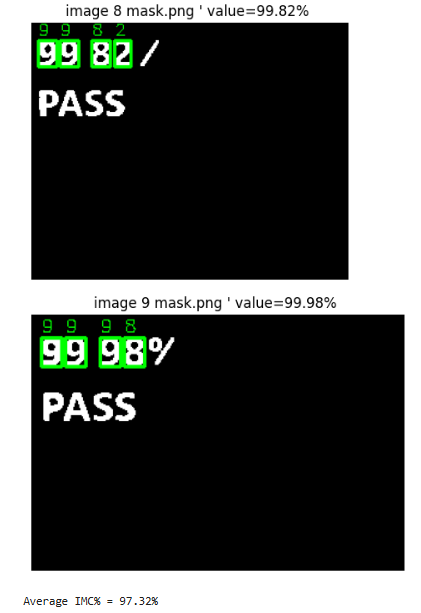

# Portfolio
This project automates the workflow to extract Intermetallic Compound (IMC) percentage readings from DOE (Design of Experiments) images. It eliminates the need to manually inspect images, read IMC values, and calculate the average by hand.

As a Wire Bond Engineer, I often need to perform design of experiments (DOE) when requested by the customer, and generating the DOE report is time-consuming especially fill in the IMC value. I repeatedly had to open 60 images for different runs, read the IMC values in each image, record them manually, and then compute averages to complete the DOE report. This process is slow and error-prone. This repository automates that workflow: it detects computer-generated IMC digits in images, extracts the numeric values (in the format XX.XX), and calculates the overall average IMC%.
It also serves as a portfolio project to demonstrate my self-taught skills in using python.

  
   
  <strong>IMC image example. Need to read the IMC values from every image which is time consuming

Key Features

1. Automatic mask generation (HSV thresholding + morphological cleaning + area thresholding) to identify red IMC text.
2. Connected component cropping to extract digit regions for template creation.
3. Template matching (0–9) with scaling and Non-Maximum Suppression (NMS) to classify digits reliably.
4. Outputs: per-image IMC values and average IMC

# IMC Detection Step-by-Step

## Step 1: Image processing
Image processing to extrace the red IMC text.

  

## Step 2: Apply Mask
Detects text edge, sort the text position to get the 4 digit and chop the digit for template creation

  

## Step 3: Template matching (0–9)
Template matching (digits 0–9) with scaling (to account for red IMC text scale varying from 90% to 110%) and Non-Maximum Suppression (NMS) to detect digits and calculate the average IMC.

  

